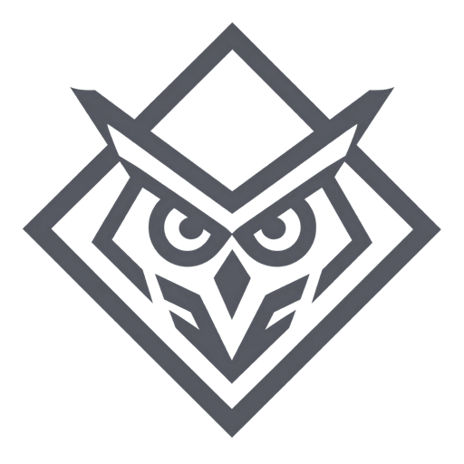

  

<h1 align="center">OwlCTF</h1>

  A self-hosted CTF platform for teams who like chasing flags and organizers who like staying in control.

OwlCTF combines challenge hosting, live competition views, team management, and event administration in one ASP.NET Core application. It runs locally from source or as a production Docker stack behind Caddy.

## Highlights

- Static challenges and isolated per-team Docker instances
- Static or CTFd-style dynamic scoring with frozen solve values
- Live standings, score progression, and recent solves
- Discord sign-in, teams, brackets, profiles, and configurable team limits
- Challenge, user, team, event, branding, sponsor, and submission administration
- First-blood Discord announcements and cross-team flag detection
- Dark and light themes with organizer-controlled branding
- Caddy, MariaDB, and Redis production stack with horizontal web scaling

## Quick start

You need Docker, a public domain, and a Discord OAuth application.

~~~sh
cp .env.example .env
# Fill in every required value in .env
docker compose up -d --build
~~~

Add https://your-domain/signin-discord as a Discord OAuth redirect, point the domain at the host, and open it in a browser. The first account to sign in becomes the initial administrator.

For host preparation, TLS, backups, upgrades, resource tuning, scaling, and dynamic challenge containers, follow the [deployment guide](docs/deployment.md).

## Documentation

| Guide | Covers |
| --- | --- |
| [Documentation index](docs/README.md) | Where to find each guide |
| [Development](docs/development.md) | Local setup, configuration, tests, and UI checks |
| [Deployment](docs/deployment.md) | Docker, Caddy, scaling, backups, and upgrades |
| [Architecture](docs/architecture.md) | Project boundaries, persistence, and runtime flow |
| [Security](docs/security.md) | Secrets, exposure, Docker access, and event data |
| [Contributing](CONTRIBUTING.md) | Workflow and pull-request expectations |

## Stack

ASP.NET Core MVC on .NET 10 · MariaDB · Dapper and EF Core · SignalR · Redis · Caddy · Docker Compose · xUnit

## Repository

~~~text
src/OwlCTF.Web/     application
tests/OwlCTF.Tests/ automated tests
docs/               operator and developer guides
~~~

OwlCTF intentionally remains one deployable web project. Its internal folders keep HTTP handling, application rules, persistence, models, views, and real-time behavior easy to follow without unnecessary project boundaries.

## Contributing

Issues and focused pull requests are welcome. Start with the [development guide](docs/development.md), then read [CONTRIBUTING.md](CONTRIBUTING.md).

## License and marks

OwlCTF software is licensed under the [GNU AGPL v3 only](LICENSE), with the
attribution and origin terms in [NOTICE](NOTICE). The OwlCTF name and official
logos are covered by the separate [trademark and brand policy](TRADEMARKS.md).

## Attribution

Hosted copies and distributions must keep the visible “Powered by [OwlCTF](https://github.com/crypt0-wizard/OwlCTF)” footer credit. It must not be removed, hidden, or changed to point elsewhere.
